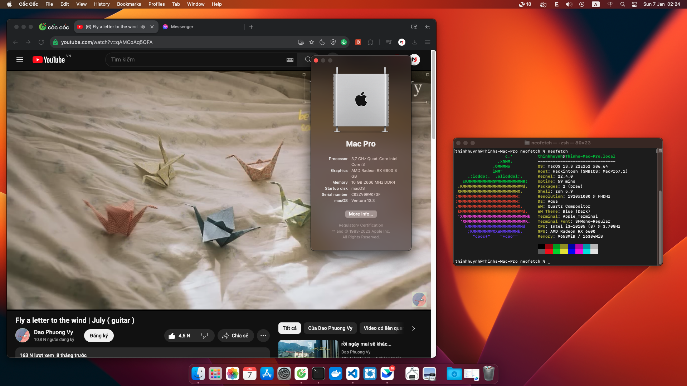

# H510M-H-Hackintosh

A repo for installing macOS Ventura - Sonoma on Asus Prime H510M-H using OpenCore.

# PC's Hardware 
- <b>CPU</b>: [Intel i3 10105](https://ark.intel.com/content/www/us/en/ark/products/201894/intel-core-i3-10105-processor-6m-cache-up-to-4-40-ghz.html) Quad-Core CPU 3.7Ghz (Comet Lake-U)
- <b>GPU</b>: GIGABYTE AMD Radeon RX 6600 8GB
- <b>Storage</b>: 256GB NVMe PCIe SSD Patriot M.2 P300
- <b>RAM</b>: 16 GB DDR4 2666MHz

# Overview 

# What's Working?
Everything Works 

# What's Not Working?
- Handoff / Airplay / Apple Continuity Features seems needs an official Wifi/BT Cards

# Bugs
- ?